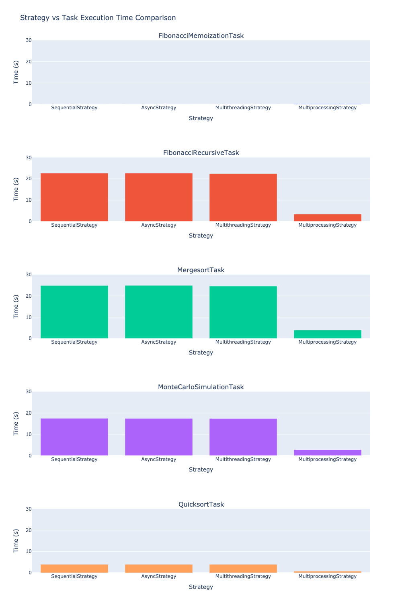
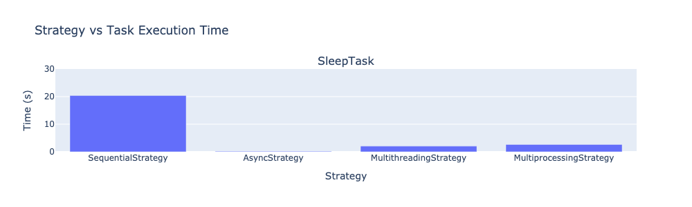

## Test Concurrency in Python

Test different methods to execute 100 tasks - sequential, async, multi-threading, and multi-processing. 

Evaluate both CPU-intensive and I/O-intensive tasks.

### CPU-intensive tasks

### IO-intensive tasks

